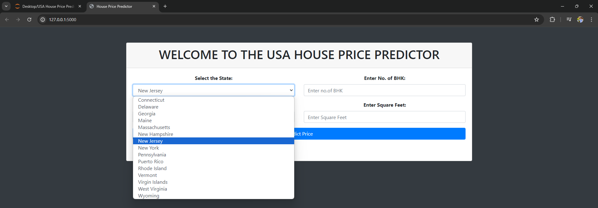
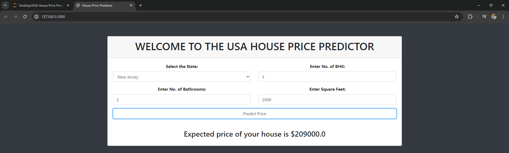

# USA House Price Prediction Model

## Overview
This repository contains a machine learning project for predicting house prices in the USA based on various input features. The project involves data preprocessing, exploratory data analysis (EDA), model training, and deployment through a Flask web application.

## Features
- **Data Preprocessing:** Handling missing values, encoding categorical variables, and feature scaling.
- **Exploratory Data Analysis (EDA):** Visualizing data distributions, correlations, and important features.
- **Model Training:** Training multiple models and selecting the best one based on performance metrics.
- **Model Export:** Saving the trained model using Joblib.
- **Web Application:** A Flask-based web app to predict house prices based on user input.

## Dataset
The dataset used for this project was downloaded from Kaggle. You can access the dataset [here](https://www.kaggle.com/datasets/ahmedshahriarsakib/usa-real-estate-dataset).

## Installation
1. Clone the repository:
    ```sh
    git clone https://github.com/JASHANPREETSINGHSALH/USA_House_Price_Prediction.git
    cd usa-house-price-prediction
    ```

2. Install the required packages:
    ```sh
    pip install -r requirements.txt
    ```

3. Run the Flask app:
    ```sh
    python app.py
    ```

4. Open your browser and go to `http://127.0.0.1:5000/`.

## Usage
1. Enter the details of the house:
    - State
    - Number of Bedrooms (BHK)
    - Number of Bathrooms
    - House Size (in square feet)

2. Click on the "Predict Price" button to get the estimated house price.

## Screenshots
### Home Page


### Prediction Result


## Model Training
The model training involves the following steps:
1. **Data Preprocessing:** Cleaning the dataset and preparing it for training.
2. **EDA:** Understanding the data through various plots and visualizations.
3. **Model Selection:** Training different regression models and evaluating their performance.
4. **Model Evaluation:** Selecting the best model based on metrics like RMSE, MAE, and R² score.
5. **Model Export:** Saving the trained model using Joblib for later use in the Flask app.

## Technologies Used
- Python
- Pandas, NumPy
- Scikit-learn
- Matplotlib, Seaborn
- Flask
- Joblib

## Contributing
If you would like to contribute to this project, feel free to create a pull request or open an issue.

## Acknowledgements
- Kaggle for the dataset
- Flask for the web framework
- Scikit-learn for the machine learning tools

